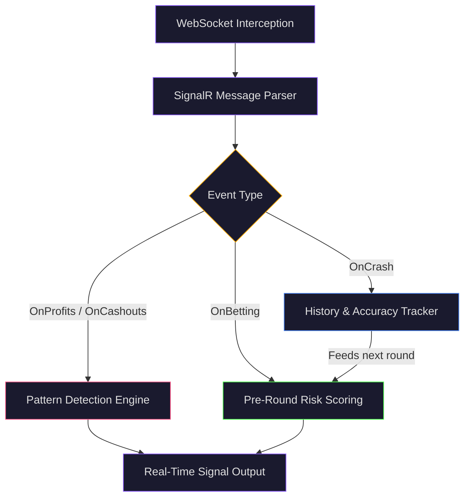
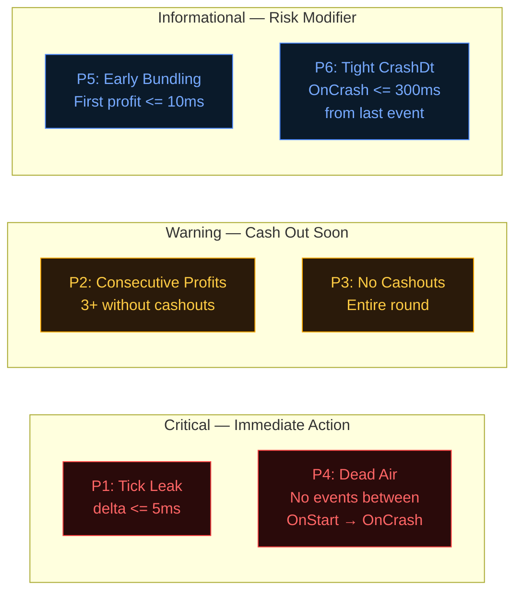
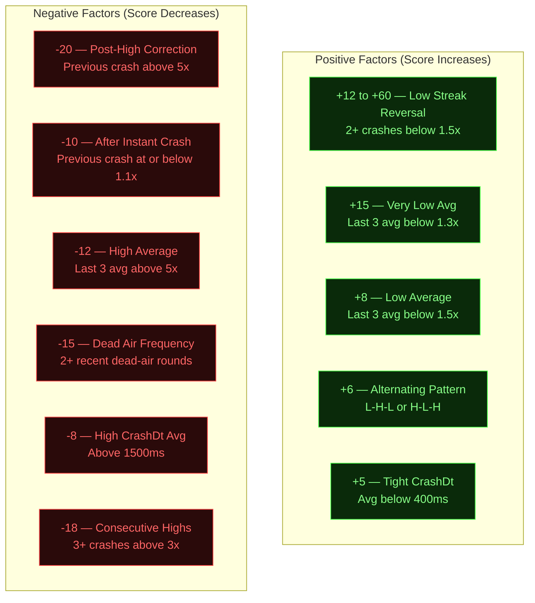
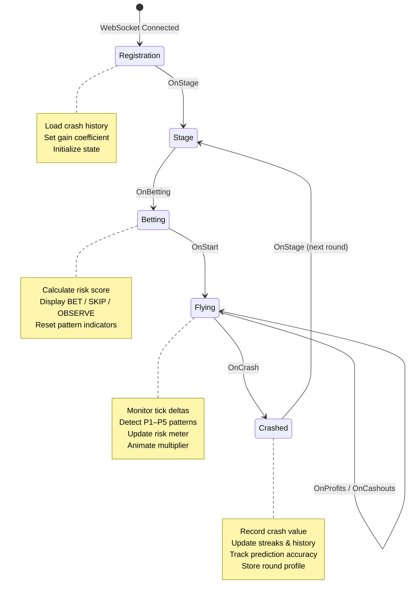

<p align="center">
  
</p>

<h1 align="center">Crash Point Signal Pro v3</h1>

<p align="center">
  <strong>Advanced Pattern-Based Signal Intelligence for Crash Point (Game 601)</strong><br/>
  Latency Analysis &bull; Tick Leak Detection &bull; Smart Risk Scoring
</p>

<p align="center">
  
  
  
  
</p>

---

> **EDUCATIONAL DISCLAIMER:** This software is developed strictly for **educational and analytical purposes**. It demonstrates real-time WebSocket interception, SignalR protocol parsing, statistical pattern recognition, and browser-based UI engineering. It is **not** intended to guarantee gambling outcomes. Gambling involves significant financial risk — use responsibly and at your own discretion.

---

## Table of Contents

- [Overview](#overview)
- [How It Works](#how-it-works)
- [Network-Level Pattern Detection](#network-level-pattern-detection)
- [Risk Scoring Engine](#risk-scoring-engine)
- [Signal Types](#signal-types)
- [Real-Time UI Components](#real-time-ui-components)
- [Game Event Lifecycle](#game-event-lifecycle)
- [Configuration](#configuration)
- [Installation](#installation)
- [Architecture](#architecture)
- [Best Practices](#best-practices)
- [Version History](#version-history)
- [License](#license)
- [Disclaimer](#disclaimer)

---

## Overview

**Crash Point Signal Pro** is a userscript that intercepts WebSocket traffic on Melbet's Crash Point game (Game 601) to perform real-time network-level pattern analysis. Built from empirical latency data, it uses six distinct detection strategies combined with a statistical scoring engine to assess round-by-round risk.

### Supported URLs

```
https://melbet-srilanka.com/games-frame/games/601*
https://*.melbet*.com/games-frame/games/601*
```

---

## How It Works

The system operates across three analysis layers:



**1. Interception Layer** — Hooks the browser's `WebSocket` constructor to capture all crash-point SignalR traffic without modifying the game client.

**2. Analysis Layer** — Parses `\x1e`-delimited SignalR messages and routes each event (`OnProfits`, `OnCashouts`, `OnStart`, `OnCrash`, etc.) through the pattern detection and scoring engines.

**3. Intelligence Layer** — Aggregates crash history, latency profiles, and detected patterns into a 0–100 risk score that drives the betting signal output.

---

## Network-Level Pattern Detection

Six empirically derived patterns are monitored in real time during each round:



### Pattern Reference

| Pattern | Name | Trigger Condition | Severity | Signal Produced |
|:-------:|------|-------------------|:--------:|-----------------|
| **P1** | Micro-Delta Tick Leak | `OnProfits` delta ≤ 5ms after previous event | **Critical** | CASH OUT NOW |
| **P2** | Consecutive Profit Flush | 3+ `OnProfits` with zero `OnCashouts` | **High** | CASH OUT SOON |
| **P3** | No Cashouts | No `OnCashouts` events during entire round | **High** | CASH OUT SOON (crash likely < 1.7x) |
| **P4** | Dead Air | `OnStart` → `OnCrash` with no intermediate events | **Critical** | Instant crash (≤ 1.2x) |
| **P5** | Early First Profit | First `OnProfits` delta ≤ 10ms | **Medium** | Risk modifier (+20 to risk meter) |
| **P6** | Tight Crash Delta | `OnCrash` arrives ≤ 300ms from last event | **Low** | Latency quality indicator |

### Pattern Detection Timeline

```
Server Tick Timeline (typical round with P1 + P2 trigger):

 OnStart    OnProfits   OnProfits   OnProfits   OnCrash
    │           │           │           │           │
    ├───800ms───┤──120ms────┤───3ms─────┤──150ms────┤
    │           │           │     ▲     │           │
    │           │           │  P1:TICK  │           │
    │           │           │  delta<=5 │           │
    │           ├───────────┴───────────┤           │
    │           │      P2: 3 CONSEC     │           │
    │           │   (no cashouts seen)  │           │
    └───────────┴───────────────────────┴───────────┘
```

---

## Risk Scoring Engine

Before each round, the system calculates a **risk score (0–100)** from multiple statistical factors. The score starts at **40** (conservative baseline) and adjusts based on recent history and latency quality.

### Scoring Factors Breakdown



### Full Scoring Table

| Factor | Condition | Adjustment | Category |
|--------|-----------|:----------:|:--------:|
| Low Streak Reversal | 2+ consecutive crashes < 1.5x | **+12** per streak (max +60) | Streak |
| Very Low Average | Last 3 rounds avg < 1.3x | **+15** | Average |
| Low Average | Last 3 rounds avg < 1.5x | **+8** | Average |
| Alternating Pattern | L-H-L or H-L-H sequence | **+6** | Pattern |
| Tight CrashDt | Average crash delta < 400ms | **+5** | Latency |
| Post-High Correction | Previous crash > 5.0x | **-20** | Streak |
| Consecutive High Wins | 3+ crashes > 3.0x | **-18** | Streak |
| Dead Air Frequency | 2+ recent dead-air rounds | **-15** | Pattern |
| High Average | Last 3 rounds avg > 5.0x | **-12** | Average |
| After Instant Crash | Previous crash ≤ 1.1x | **-10** | Streak |
| High CrashDt Average | Average crash delta > 1500ms | **-8** | Latency |

### Score-to-Advice Mapping

```
  SCORE     0 ──────── 25 ──────── 40 ──────── 55 ──────── 70 ──────── 100
  ADVICE    │   SKIP   │   RISKY  │  OBSERVE  │ LEAN BET │   BET    │
  COLOR     │ ██ Red   │ ██ Orange│ ██ Purple │ ██ L.Grn │ ██ Green │
  RISK      │  Danger  │  Risky   │  Neutral  │  Maybe   │  Good    │
```

---

## Signal Types

### Pre-Round Signals (Betting Phase)

| Signal | Class | Score Range | Visual | Description |
|--------|:-----:|:----------:|--------|-------------|
| **BET NOW** | `bet` | ≥ 70 | Green glow animation | Strong buy — multiple positive signals converge |
| **LEAN BET** | `lean` | 55 – 69 | Light green | Slight edge detected — moderate confidence |
| **OBSERVE** | `observe` | 40 – 54 | Purple | No strong signal — default conservative stance |
| **RISKY** | `risky` | 25 – 39 | Orange pulse animation | Multiple danger signs — exercise caution |
| **SKIP** | `skip` | < 25 | Red | High crash probability — do not bet |

### In-Flight Signals (During Round)

| Signal | Trigger | Visual | Priority |
|--------|---------|--------|:--------:|
| **CASH OUT NOW** | P1 tick leak detected | Red rapid flash | **Highest** |
| **CASH OUT SOON** | P2 consecutive profits / P3 no cashouts | Orange pulse | **High** |
| **FLYING** | Active round with cashouts | Purple steady | **Normal** |

---

## Real-Time UI Components

### Panel Layout

```
┌──────────────────────────────────┐
│  CP SIGNAL PRO v3          — ✕  │  ← Header (draggable)
├──────────────────────────────────┤
│           2.47x                  │  ← Live Multiplier
│     ┌────────────────────┐       │
│     │   ✅ BET NOW       │       │  ← Signal Box
│     │  3 low streak...   │       │
│     └────────────────────┘       │
│  ▓▓▓▓▓▓▓▓░░░░░░░░░░░░░  35%    │  ← Risk Meter
│  ▓▓▓▓▓▓▓▓▓▓▓▓▓▓▓░░░░░░  72     │  ← Score Bar
│                                  │
│  [P1] [P2] [NC] [P5] [DA] [STR] │  ← Pattern Indicators
├──────────────────────────────────┤
│  Δ Last │ Consec │ Low  │Rounds │
│   42ms  │   0    │  3   │  18   │  ← Statistics Grid
├──────────────────────────────────┤
│  12:34.567  P1: CASH OUT Δ3ms   │  ← Event Log
│  12:33.891  ✅ BET — score 72   │
│  12:32.100  Crashed 1.24x       │
├──────────────────────────────────┤
│ 1.24 1.87 4.21 1.02 2.55 1.11   │  ← Crash History
├──────────────────────────────────┤
│  Bet: 67% (4/6)  Skip: 75% (3/4)│  ← Accuracy Tracker
├──────────────────────────────────┤
│  ● Live                  flying  │  ← Status Footer
└──────────────────────────────────┘
```

### UI Element Reference

| Element | ID | Description |
|---------|-----|-------------|
| Multiplier Display | `#cp-mult` | Live multiplier with color states: green (growing), red (crashed), gray (waiting) |
| Signal Box | `#cp-signal` | Primary advice output with animated CSS classes per signal type |
| Risk Meter | `#cp-risk-fill` | Horizontal bar (0–100%) — green → orange → red gradient |
| Score Bar | `#cp-score-fill` | Numerical score visualization with color-coded background |
| Pattern Indicators | `#ci-p1` ... `#ci-str` | Six toggleable badges: `off`, `on` (red), `mild` (orange), `info` (blue) |
| Event Log | `#cp-log` | Scrollable log (max 50 entries) with severity-coded left borders |
| Crash History | `#cp-history` | Last 20 crashes — red (< 1.5x), orange (1.5–3x), green (> 3x) |
| Accuracy Display | `#cp-accuracy` | Running BET/SKIP accuracy percentages with color feedback |
| Connection Status | `#cp-wsd` | WebSocket state dot: green (live), orange (waiting), red (closed) |

---

## Game Event Lifecycle



### Event Processing Summary

| Event | Status Code | Actions Performed |
|-------|:----------:|-------------------|
| `OnRegistration` | — | Set gain coefficient (`kx`), load crash history from `fs` or `h` arrays, resume mid-round if `s === 3` |
| `OnStage` | `1` | Reset all round state (profits, deltas, cashouts, indicators), prepare for new round |
| `OnBetting` | `2` | Run `assessPreRoundRisk()`, compute 0–100 score, display signal with top reason |
| `OnStart` | `3` | Start multiplier animation (`requestAnimationFrame` loop), record `coeffStartTime` |
| `OnProfits` | `3` | Track deltas, check P1/P2/P3/P5, update risk meter, fire cash-out signals |
| `OnCashouts` | `3` | Reset consecutive profit counter, mark cashouts present, clear NO-CO indicator |
| `OnCrash` | `4` | Stop animation, update crash history (max 30), track streaks, store round profile (max 50), update accuracy |

---

## Configuration

### Runtime API

```javascript
// Remove the script entirely
window.__cpsignal_destroy();

// Update any configuration parameter
window.__cpsignal_cfg("key", value);
```

### Configurable Parameters

| Parameter | Default | Type | Description |
|-----------|:-------:|:----:|-------------|
| `P1_DELTA` | `5` | ms | Tick leak detection threshold — events closer than this are flagged as server-tick bundled |
| `P2_CONSEC` | `3` | count | Consecutive `OnProfits` needed to trigger crash-approaching warning |
| `P5_FIRST_PROFIT` | `10` | ms | Early bundling threshold for the first profit event |
| `MIN_MULT` | `1.1` | x | Minimum multiplier before cash-out signals activate |
| `STREAK_LOW_THRESH` | `1.5` | x | Crashes below this value increment the low streak counter |
| `STREAK_HIGH_THRESH` | `5.0` | x | Crashes at or above this value increment the high streak counter |
| `STREAK_COUNT` | `2` | count | Minimum streak length before factoring into score |
| `MIN_ROUNDS_FOR_BET` | `3` | count | Rounds of data needed before issuing BET advice |
| `BET_SCORE_THRESH` | `70` | score | Minimum score required for a BET signal |

### Example Tuning

```javascript
// More aggressive — lower the BET threshold
window.__cpsignal_cfg("BET_SCORE_THRESH", 60);

// More conservative — require more history
window.__cpsignal_cfg("MIN_ROUNDS_FOR_BET", 5);

// Adjust tick leak sensitivity
window.__cpsignal_cfg("P1_DELTA", 8);
```

---

## Installation

### Prerequisites

- A modern browser (Chrome, Firefox, Edge)
- A userscript manager extension:

| Extension | Chrome | Firefox | Edge |
|-----------|:------:|:-------:|:----:|
| [Tampermonkey](https://www.tampermonkey.net/) | Yes | Yes | Yes |
| [Violentmonkey](https://violentmonkey.github.io/) | Yes | Yes | Yes |
| [Greasemonkey](https://www.greasespot.net/) | — | Yes | — |

### Steps

1. Install one of the userscript managers listed above
2. Click the extension icon → **Create a new script**
3. Delete the template content and paste the full contents of [`crash-point-scanner.js`](crash-point-scanner.js)
4. Save the script (<kbd>Ctrl</kbd>+<kbd>S</kbd>)
5. Navigate to a supported Melbet Crash Point URL
6. The signal panel appears in the **top-right corner** — drag to reposition

---

## Architecture

### Technical Stack

```
┌─────────────────────────────────────────────────┐
│                 Userscript Layer                 │
│  ┌───────────────────────────────────────────┐  │
│  │         WebSocket Constructor Hook         │  │
│  │   window.WebSocket = function(url, proto)  │  │
│  └──────────────────┬────────────────────────┘  │
│                     │                            │
│  ┌──────────────────▼────────────────────────┐  │
│  │          SignalR Message Parser            │  │
│  │   Split by \x1e → JSON.parse → route      │  │
│  └──────────────────┬────────────────────────┘  │
│                     │                            │
│  ┌──────────────────▼────────────────────────┐  │
│  │            Event Handler Core             │  │
│  │  ┌─────────┐  ┌──────────┐  ┌─────────┐  │  │
│  │  │ Pattern │  │  Scoring │  │ History │  │  │
│  │  │ Detect  │  │  Engine  │  │ Tracker │  │  │
│  │  └────┬────┘  └────┬─────┘  └────┬────┘  │  │
│  └───────┼────────────┼─────────────┼────────┘  │
│          └────────────┼─────────────┘            │
│                       │                          │
│  ┌────────────────────▼──────────────────────┐  │
│  │              UI Renderer                   │  │
│  │  Fixed overlay • CSS animations • Drag    │  │
│  └───────────────────────────────────────────┘  │
└─────────────────────────────────────────────────┘
```

### Multiplier Formula

The live multiplier is calculated using the game's quadratic coefficient:

```
multiplier = min((gainCoef / 1,000,000,000) * elapsed_ms² + 1, 35)
```

Where `gainCoef` defaults to `25` and is overridden by the `kx` field in `OnRegistration`.

### State Management

The script maintains a single state object `S` with the following tracked data:

| Category | Fields | Retention |
|----------|--------|:---------:|
| Round State | `consecutiveProfits`, `profitsDeltas`, `hasCashouts`, `roundEvents`, `firstProfitDt` | Per round |
| Latency | `bettingDt`, `startDt`, `lastCrashDt`, `avgCrashDt`, `crashDtHistory` | Rolling 20 |
| History | `crashHistory`, `lowStreak`, `highStreak`, `deadAirRounds` | Rolling 30 |
| Accuracy | `betsCorrect`, `betsTotal`, `skipsCorrect`, `skipsTotal`, `totalRounds` | Cumulative |
| Profiles | `roundProfileHistory` | Rolling 50 |

---

## Best Practices

| Practice | Details |
|----------|---------|
| **Wait for data** | Allow at least 3 rounds (`MIN_ROUNDS_FOR_BET`) before acting on BET signals |
| **Respect P1** | The tick leak pattern is the highest-confidence indicator — cash out immediately when triggered |
| **Watch the score, not just the signal** | A score of 68 (LEAN BET) is materially different from 72 (BET) |
| **Monitor accuracy** | The built-in accuracy tracker shows how well the system is performing in the current session |
| **Avoid chasing** | After 3+ consecutive high crashes, the system scores this as -18 (correction zone) — trust the model |
| **Default is OBSERVE** | The system is intentionally conservative; it will not recommend BET unless multiple factors align |

---

## Version History

| Version | Release | Highlights |
|:-------:|---------|------------|
| **3.0** | Current | Full rewrite — six network-level patterns (P1–P6), latency-informed 0–100 scoring engine, pre-round intelligence, accuracy tracking, round profile storage, dead-air detection, alternating pattern recognition |

---

## License

Copyright &copy; 2026 — All Rights Reserved.

This software is proprietary and licensed under the **Crash Point Signal Pro License**.
See the [LICENSE](LICENSE) file for full terms and conditions.

| Permission | Status |
|------------|:------:|
| Personal / Educational Use | Permitted |
| Studying & Learning from Code | Permitted |
| Personal Modifications | Permitted |
| Commercial Use | **Prohibited** |
| Redistribution | **Prohibited** |
| Derivative Works | **Prohibited** |
| Selling Signals as a Service | **Prohibited** |

---

## Disclaimer

> **This tool is developed for educational and analytical purposes only.** It demonstrates techniques in WebSocket interception, real-time data analysis, statistical pattern recognition, and browser-based UI development. It is provided as a learning resource and does **not** guarantee any financial outcome.
>
> - Gambling involves significant financial risk
> - Past patterns do not guarantee future results
> - This software provides no guaranteed outcomes
> - The developers assume **no liability** for any losses incurred
> - Use responsibly and at your own discretion

---

<p align="center">
  <sub>Built with precision &bull; Crash Point Signal Pro v3 &bull; &copy; 2026</sub>
</p>
